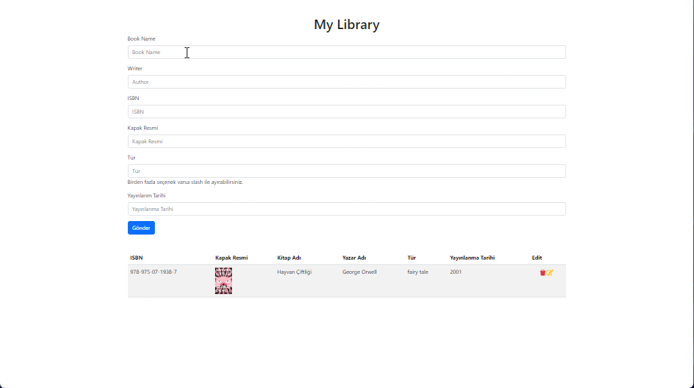

# Hi I'm Nurdoğan Bahadır 👋. Welcome to my Todo App Project with React.

This project was developed using React. Data was imported and used with Axios. Post, delete, get and put operations were done. With this project you can add, store and update data.

# Live Link of the Project

[Click Me](https://my-library-nurdoganbahadir.netlify.app/)

# Libraries and Technologies I use

- useState
- useEffect
- react bootstrap
- bootstrap
- react icons
- uuid
- axios
- API
  

# How to install

In the project directory, open the terminal and run:

### `npm install`

This will install the necessary dependencies. After that, you can run:

### `npm start`

# How does my project look

